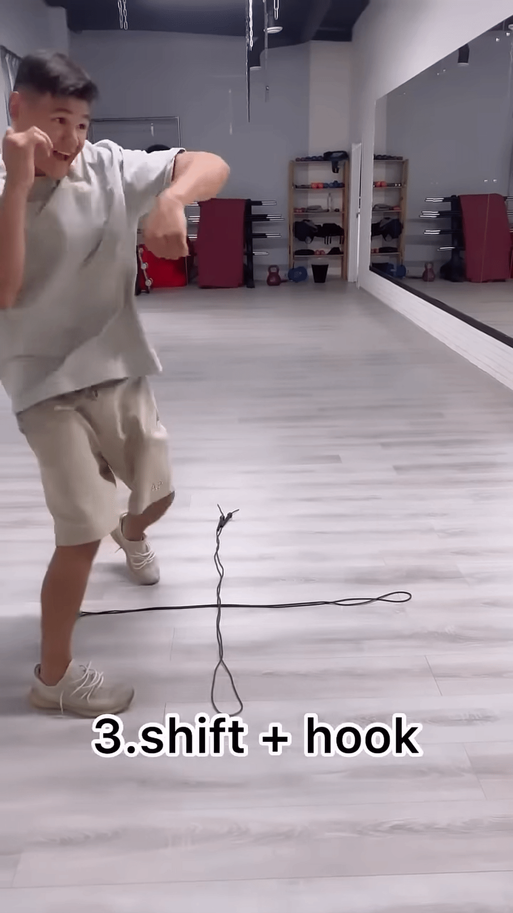

# Cycle Detection in Human Joint Movements 🏃‍♂️

A robust Python solution for analyzing human motion patterns by tracking body joints in videos and detecting movement cycles. Perfect for biomechanics research, sports analysis, and motion studies.

## 🎯 Key Features

- Real-time tracking of 12 major body joints
- 3D trajectory extraction and analysis
- Automated cycle detection across multiple motion planes
- Detailed analysis reports in CSV and JSON formats
- Single-person motion tracking and analysis

## 🎥 Example

Input Video                        |  Joint Tracked                     |
-----------------------------------|------------------------------------|
 | | 

## 🚀 Getting Started

### Prerequisites

- Python 3.x
- Clear video footage of a single person
- Stable camera position recommended

### Installation

```bash
pip install -r requirements.txt
```

### Quick Start

1. Download a sample video:
```bash
yt-dlp -S ext:mp4:m4a https://www.youtube.com/shorts/DftBUdHgr9Q -o input/DftBUdHgr9Q.mp4
```

2. Run the analysis:
```bash
# Track joints
python3 getPoseLandmarks.py -i input/DftBUdHgr9Q.mp4 -o output/trajectories.csv

# Detect cycles
python3 CycleDetection.py -i output/trajectories.csv -o output/cycles.json
```

## 🏗️ Project Structure

```
├── CycleDetection.py      # Cycle detection algorithms
├── getPoseLandmarks.py    # Joint tracking implementation
├── input/                 # Input video files
├── output/               # Generated analysis files
│   ├── cycles.json
│   └── trajectories.csv
└── README.md
```

## 📊 Data Pipeline

1. **Video Processing**
   - Frame extraction
   - RGB conversion
   - Pose detection

2. **Joint Tracking**
   - MediaPipe integration
   - 3D coordinate capture
   - Confidence scoring

3. **Analysis**
   - Coordinate normalization
   - Trajectory smoothing
   - Cycle detection
   - Report generation

## ⚙️ Technical Details

### Tracked Joints
- Shoulders
- Elbows
- Wrists
- Hips
- Knees
- Ankles

### System Requirements
- Clear subject visibility
- Subject within frame
- Single person in view
- Minimum 4 data points per cycle

## 🔄 Output Files

### trajectories.csv
- Joint coordinates
- Tracking confidence scores
- Temporal data

### cycles.json
- Detected motion cycles
- Statistical analysis
- Pattern metrics

## 🔜 Future Improvements

- Parallel processing support
- GPU acceleration
- Multi-person tracking
- Machine learning enhancements
- Advanced filtering algorithms

## ⚠️ Limitations

- Single person analysis only
- Depends on MediaPipe accuracy
- Requires clear visibility
- Subject must stay in frame

## 🧪 Testing

The system includes comprehensive test cases for:
- Input validation
- Pose detection accuracy
- Cycle detection reliability
- Data integrity
- Edge case handling

## 📈 Performance Optimization

Future releases will focus on:
- Parallel processing
- Memory optimization
- Batch processing
- Enhanced filtering
- ML-based pattern recognition
