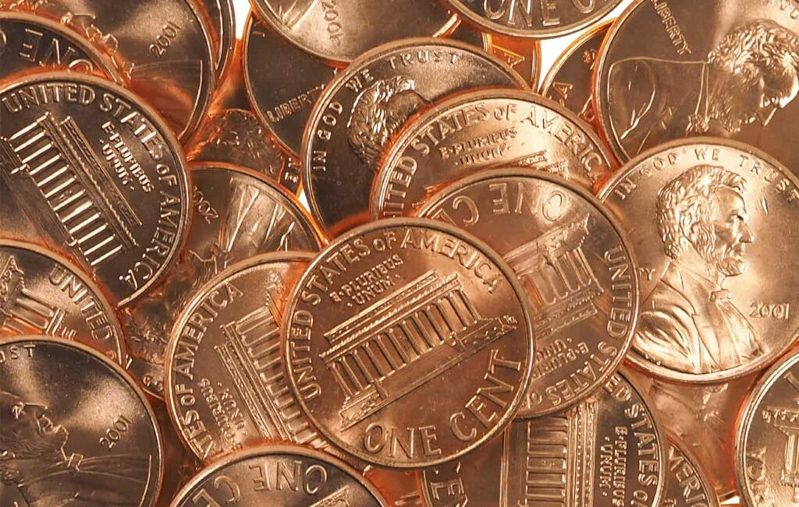
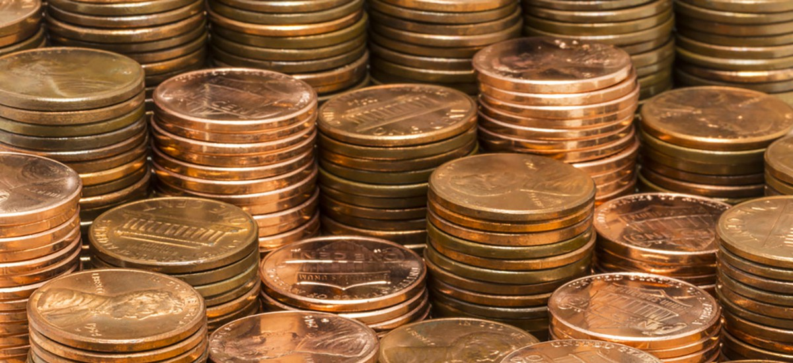
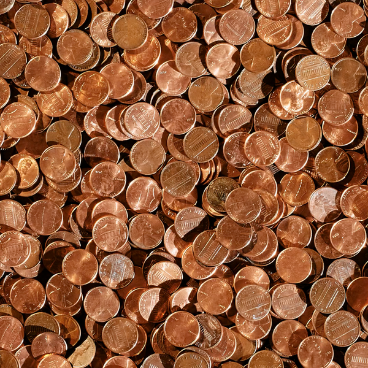
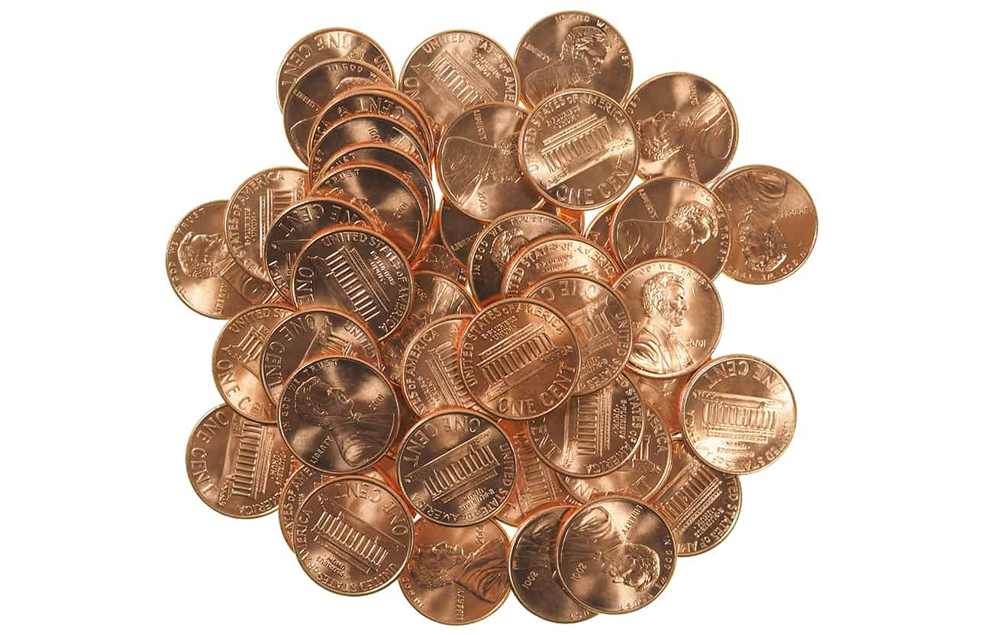
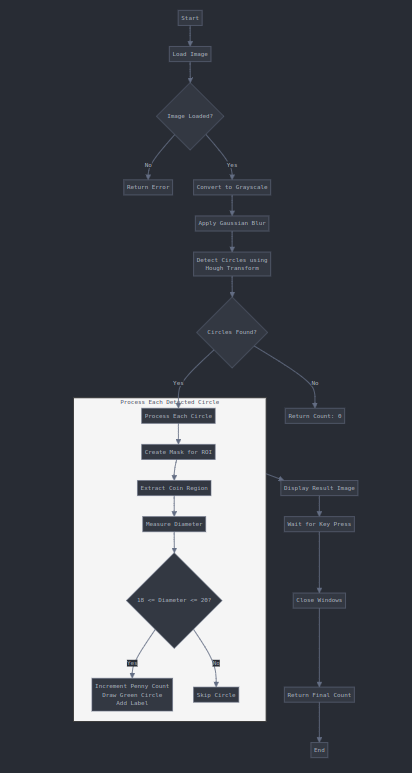

## Counting similar objects

### Problem Statement

You are tasked with developing a solution to count the number of U.S. pennies in an image. The input is an image containing coins scattered on a flat surface. Your goal is to identify and count the pennies while ignoring other types of coins or objects in the image.

Sample Images        |  Results |
---------------------|----------|
|          |
|          |
|          |
|          |

### Steps to Solve

#### 1. **Preprocessing the Image**
   - **Convert to Grayscale**:
     - Reduce complexity by working with intensity values rather than RGB.
   - **Apply Gaussian Blur**:
     - Smooth the image to reduce noise that could interfere with circle detection.
   - **Edge Detection**:
     - Use techniques like the Canny edge detector to highlight the coin edges.

#### 2. **Circle Detection**
   - Use the **Hough Circle Transform** to detect circular objects in the image.
   - This method identifies all circular coins in the image, regardless of type.

#### 3. **Coin Classification**
   - Distinguish pennies from other coins based on their size (diameter in pixels) and color if necessary:
     - **Diameter Check**:
       - U.S. penny diameter: 19.05 mm.
       - Compare this to other coins:
         - Nickel: 21.21 mm.
         - Dime: 17.91 mm.
         - Quarter: 24.26 mm.
       - Use pixel-to-mm conversion based on a known reference (e.g., a ruler or pre-calibrated system).
     - **Color Analysis**:
       - If necessary, use the average color within each detected circle to identify pennies, as they typically have a coppery hue.

#### 4. **Counting Pennies**
   - Filter detected circles to include only those that match the penny's size and/or color.
   - Count the remaining coins.

### Architecture components

1. **Hough Circle Transform**:
   - Detects all circular coins in the image.
   - Returns their centers and radii.

2. **Diameter Filtering**:
   - Filters circles based on their diameter to match the size of a penny.

3. **Optional Color Filtering**:
   - If needed, analyze the mean color inside each circle to confirm the coppery appearance of pennies.

4. **Result Visualization**:
   - Draws detected pennies on the image for verification.

---

### Key Considerations
- **Calibration**:
  - Ensure the image scale (pixels per mm) is accurate for reliable diameter measurements.
- **Lighting**:
  - Uniform lighting is essential to reduce errors caused by shadows or reflections.
- **Overlapping Coins**:
  - Overlapping coins may complicate detection and classification. Advanced segmentation techniques can be employed if necessary.

